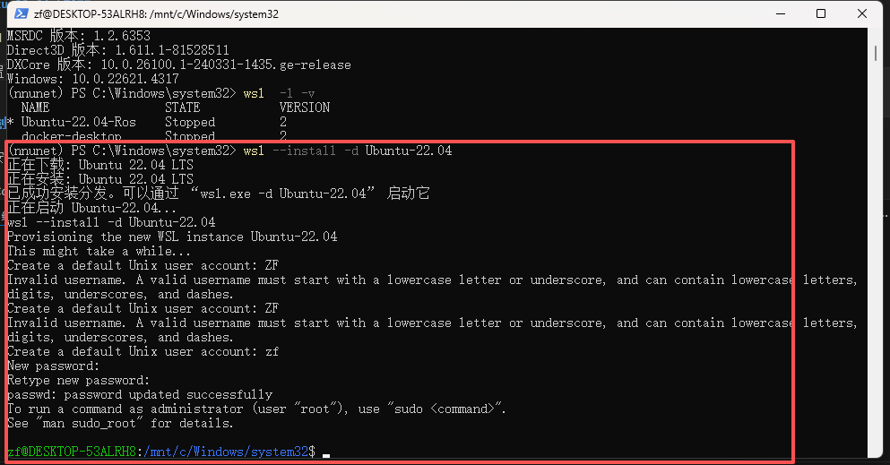
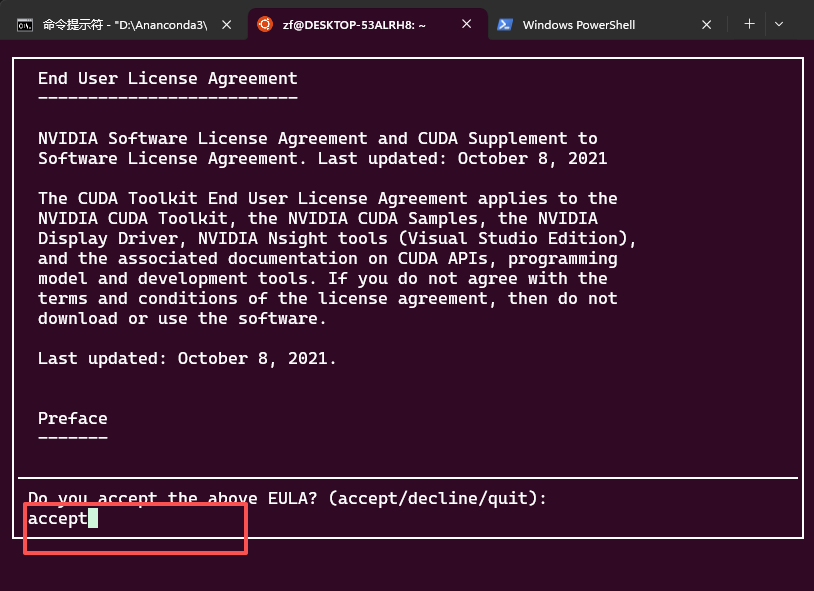
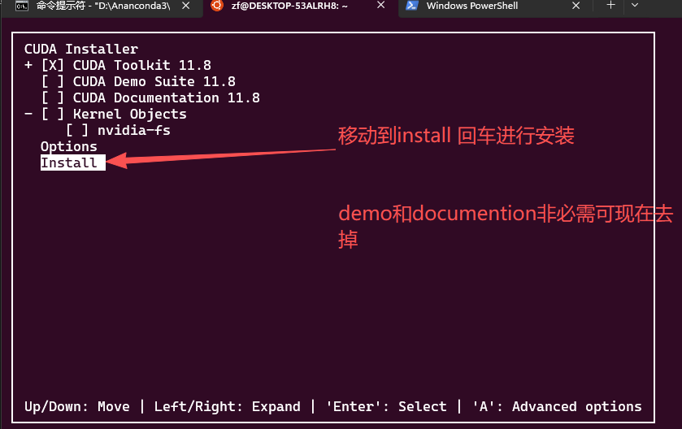
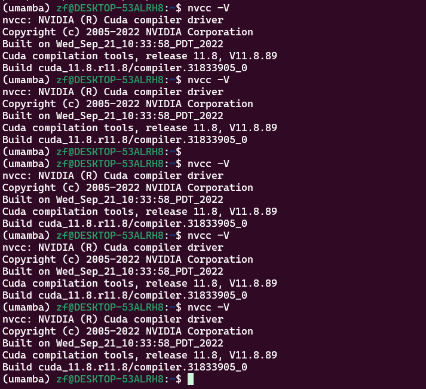
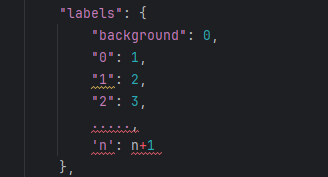

# Umamba 使用指南

<a id="top"></a>

<details>
<summary><b>目录📑</b></summary>

- [1. 环境安装](#1-环境安装)
   - [步骤 0：启用 WSL2 并安装原生 Ubuntu 22.04](#步骤-0启用-wsl2-并安装原生-ubuntu-2204)
   - [步骤 1：在 Ubuntu 22.04 中安装 Miniconda](#步骤-1在-ubuntu-2204-中安装-miniconda)
   - [步骤 2：配置 cuda 环境](#步骤-2配置-cuda-环境)
   - [步骤 3：安装U-Mamba依赖](#步骤-3安装u-mamba依赖)
   - [步骤 4：克隆仓库与嵌入环境](#步骤-4克隆仓库与嵌入环境)
- [2. 数据处理](#2-数据处理)
   - [数据分类工具（目前仅有2d）](#数据分类工具目前仅有2d)
- [3. 训练](#3-训练)
   - [数据预处理](#数据预处理)
   - [训练2d模型](#训练2d模型)
   - [训练3d模型](#训练3d模型)
- [4.模型导出(目前仅适配mamba)](#4模型导出目前仅适配mamba)
   - [模型准备](#模型准备)
   - [启动程序autoExport.py](#启动程序autoexportpy)
   - [基本操作流程](#基本操作流程)
- [5. 推理](#5-推理)
   - [运行推理](#运行推理)
- [7. 评估](#7-评估)
   - [评估预测结果](#评估预测结果)
- [8. 高级用法](#8-高级用法)
   - [使用预训练模型](#使用预训练模型)
- [9. 参考资料](#9-参考资料)
- [10. 报错解决方法](#10-报错解决方法)
</details>


## 1. 环境安装
### 步骤 0：启用 WSL2 并安装原生 Ubuntu 22.04
**0.1 启用 WSL2 核心组件**\
以管理员身份打开 PowerShell，执行以下命令：
```powershell
# 启用WSL和虚拟机平台
wsl --install --no-distribution
# 设置WSL默认版本为2
wsl --set-default-version 2
```
执行后重启电脑，完成基础组件安装。

**0.2 安装 Ubuntu 22.04 LTS**
```powershell
wsl --install -d Ubuntu-22.04
```
首次启动，需要设置 Linux 用户名和密码（与 Windows 账户无关）
，例如这里我把用户名设置成zf，密码为123456

### 步骤 1：在 Ubuntu 22.04 中安装 Miniconda
**1.1更新系统依赖（Ubuntu 22.04 必备）**
   ```bash
   # 启动自定义Ubuntu 22.04后执行
   sudo apt update && sudo apt upgrade -y
   # 安装基础编译工具（后续装mamba-ssm需要）
   sudo apt install wget git gcc g++ make -y   
   ```
**1.2 下载并安装 Miniconda**
   ```bash
   # 进入用户主目录
   cd ~
   # 下载Miniconda（适配Linux x86_64，Ubuntu 22.04兼容）
   wget https://repo.anaconda.com/miniconda/Miniconda3-latest-Linux-x86_64.sh

   # 执行安装脚本
   bash Miniconda3-latest-Linux-x86_64.sh
   #---------------------安装过程中关键操作----------------------
   按 Enter 阅读许可，输入yes同意；
   安装路径默认/home/umamba_user/miniconda3（替换为你的用户名），直接 Enter；
   最后询问「Do you wish to initialize Miniconda3 by running conda init?」，输入yes（自动配置环境变量）。
   ```
   **1.3 验证 Miniconda 安装**
   ```bash
   # 重启终端（或刷新环境变量）
   source ~/.bashrc
   # 检查conda版本（输出类似conda 24.x.x）
   conda --version
   ```
   1.4 Conda 新版本的强制要求：使用官方 Anaconda 源（repo.anaconda.com）前必须接受其服务条款（Terms of Service, ToS），否则无法创建新环境。
   ```bash
   # 接受 main 通道的服务条款
   conda tos accept --override-channels --channel https://repo.anaconda.com/pkgs/main

   # 接受 r 通道的服务条款
   conda tos accept --override-channels --channel https://repo.anaconda.com/pkgs/r

   ```
### 步骤 2：配置 cuda 环境 

**2.1 创建并激活 conda 环境：**
   ```bash
   # 创建名为umamba的环境，Python=3.10
   conda create -n umamba python=3.10 -y
   # 激活环境
   conda activate umamba
   ```
**2.2 验证 WSL2 Ubuntu 22.04 的 CUDA（关键）**
   ```bash
   # 查看CUDA信息（输出应包含CUDA Version）
   nvidia-smi
   ```
   目前windows下cuda都有wsl兼容功能，无需在wsl中重新安装，若不显示可能是windows的cuda版本过低，建议在windows下升级到11.8以上的版本 

**2.3 安装wsl下的nvidia-cuda-toolkit**\
   WSL2 中的 nvidia-cuda-toolkit（CUDA 工具包）与 Windows 端完全隔离，但 WSL2 会复用 Windows 端的 NVIDIA 显卡驱动（唯一共享组件）。
   ```bash
   ###为了与windows下驱动保持一致这里使用11.8版本
   #1.下载安装包
   wget https://developer.download.nvidia.com/compute/cuda/11.8.0/local_installers/cuda_11.8.0_520.61.05_linux.run  
   #2.运行安装脚本
   sudo sh cuda_11.8.0_520.61.05_linux.run
   ```
- 等待加载完毕后 输入`accept`接受条款
  
- 移动到`Install`选择回车安装
   

   安装完后运行
   ```bash
   nvcc -V
   ```
   若输出图下图则表明，安装成功
   

### 步骤 3：安装U-Mamba依赖
   **3.1 安装torch：**
   
  
- 激活conda环境
    ```bash
   conda activate umamba
   ```
- 安装pytorch
   ```bash
   #官方源：
   pip install torch==2.0.1 torchvision==0.15.2 --index-url https://download.pytorch.org/whl/cu118

   #华为源：
   pip install torch==2.0.1 torchvision==0.15.2 --index-url https://repo.huaweicloud.com/repository/pypi/simple/  --extra-index-url https://repo.huaweicloud.com/pytorch/whl/cu118/
    ```
- 安装 Mamba-ssm 依赖
  ```bash
   # 安装causal-conv1d（适配Ubuntu 22.04编译环境）
    pip install causal-conv1d==1.2.0.post2 --verbose --no-build-isolation --no-cache-dir

   # 安装mamba-ssm（关键，Ubuntu 22.04需禁用缓存避免编译错误）
    pip install mamba-ssm==1.2.0.post1 --no-cache-dir --verbose --no-build-isolation
    ```
    编译过程较久请耐心等待

- 测试安装与否
  ```bash
  python -c "import torch; import mamba_ssm; print('CUDA:', torch.version.cuda); print('GPU:', torch.cuda.is_available())"
  ```
  若出现如下报错是：第一行报错 Disabling PyTorch because PyTorch >= 2.4 is required 是因为你环境中可能残留了某个新版组件（比如最近版本的 transformers 或 accelerate）在检测你的环境。
  ```bash
  Disabling PyTorch because PyTorch >= 2.4 is required but found 2.0.1+cu118
   PyTorch was not found. Models won't be available and only tokenizers, configuration and file/data utilities can be used.
   Traceback (most recent call last):
   File "<string>", line 1, in <module>
   File "/home/zf/miniconda3/envs/umamba/lib/python3.10/site-packages/ mamba_ssm/__init__.py", line 5, in <module>
   from mamba_ssm.models.mixer_seq_simple import MambaLMHeadModel
   File "/home/zf/miniconda3/envs/umamba/lib/python3.10/site-packages/mamba_ssm/models/mixer_seq_simple.py", line 15, in <module>
   from mamba_ssm.utils.generation import GenerationMixin
   File "/home/zf/miniconda3/envs/umamba/lib/python3.10/site-packages/mamba_ssm/utils/generation.py", line 14, in <module>
   from transformers.generation import GreedySearchDecoderOnlyOutput, SampleDecoderOnlyOutput, TextStreamer
   ImportError: cannot import name 'GreedySearchDecoderOnlyOutput' from 'transformers.generation' (/home/zf/miniconda3/envs/umamba/lib/python3.10/site-packages/transformers/generation/__init__.py)
   ```
   解决方法：运行`pip install transformers==4.39.0`
   出现如下指令，表示成功：
   ```bash
   CUDA: 11.8
   GPU: True
   ```
### 步骤 4：克隆仓库与嵌入环境
1. 将nnunetv2内嵌入conda环境：
   ```bash
   cd nnUNet/umamba
   pip install -e .
   ```
   <span style="color:red;">push:</span>如果有修改源码需要重新运行`pip install -e .`将修改后的代码嵌入到conda环境

2. 验证安装：
   ```
   nnUNetv2_plan_and_preprocess -h
   ```
<p align="right"><a href="#top">⬆ 返回顶部</a></p>


## 2. 数据处理
<video src="./assets/Video Project 3.mp4" controls width="100%"></video>
<span style="color:red;">**push:**</span>
<span style="color:yellow;">若无法播放请点击[Video Project 3.mp4](./assets/Video%20Project%203.mp4)跳转查看</span>

nnUNet data下已创建三个文件夹：
- `nnUNet_raw`：原始数据集存储位置
- `nnUNet_preprocessed`：预处理数据集存储位置
- `nnUNet_results`：训练结果和模型存储位置
### 数据分类工具（目前仅有2d）
因为nnuent的数据集需要以特定的形式命名(详细可见[dataset_format.md](https://github.com/MIC-DKFZ/nnUNet/blob/master/documentation/dataset_format.md))，这里通过编写一个tool直接进行处理\
\
运行[dataSet_Tool.py](./dataSet_Tool.py)\

- `原始图片目录`：原始数据集图片存储位置\
 -- 仅支持`bmp，tif，tiff，png`格式；\
 -- JPG 为了缩小体积，会强制模糊高频细节（边缘、角落、小目标）故不使用此格式进行训练。

- `json标签目录`：原始数据集json存储位置\
  --标签label需要以"0"、“1”、"2"、…… 、“n”字母排序过去\
  --由于训练的时候背景像数值需要设置为0，故对应的mask像数值映射为(背景->0, 0->1 , 1->2 , .... , n->n+1)\


- `nnUNet_raw`：上面创建的data文件夹内nnUNet_raw文件夹
<p align="right"><a href="#top">⬆ 返回顶部</a></p>

## 3. 训练
   为了于前面的一致U-mamba也是搭建在主流的nnUent分割
框架上，因此训练流程和nnuent是一致的
### 数据预处理
```bash
nnUNetv2_plan_and_preprocess -d DATASET_ID --verify_dataset_integrity
```
其中：
`DATASET_ID`：数据集 ID（例如 001）
### 训练2d模型

- Train 2D `U-Mamba_Bot` model
   ```bash
   nnUNetv2_train DATASET_ID 2d all -tr nnUNetTrainerUMambaBot
   ```
- Train 2D `U-Mamba_Enc ` model
   ```bash
   nnUNetv2_train DATASET_ID 2d all -tr nnUNetTrainerUMambaEnc   
   ```
   -  U-Mamba_Enc	整个编码器全部换成 Mamba\
    U-Mamba_Bot	只在网络最底部的瓶颈层用 Mamba\
### 训练3d模型
   
- Train 3D `U-Mamba_Bot` model
   ```bash
   nnUNetv2_train DATASET_ID 3d_fullres all -tr nnUNetTrainerUMambaBot
   ```
- Train 3D `U-Mamba_Enc ` model
   ```bash
   nnUNetv2_train DATASET_ID 3d_fullres all -tr nnUNetTrainerUMambaEnc   
   ```
  - U-Mamba_Enc	整个编码器全部换成 Mamba\
    U-Mamba_Bot	只在网络最底部的瓶颈层用 Mamba

 可添加参数：
| **参数位置 / 名称** | **作用** |
| :--- | :--- |
| dataset_name_or_id（第 1 个参数） | 指定要训练的「数据集标识」 |
| configuration（第 2 个参数） | 指定训练的「模型配置（如2d、3d_fullres、3d_lowres）」 |
| fold（第 3 个参数） | 指定 5 折交叉验证的「折数」,只能填 0-4 之间的整数,想完成 5 折训练需要分别跑fold=0/1/2/3/4 |
| -tr | 指定训练用的「核心训练器类」,默认nnUNetTrainer |
| -p  | 指定训练用的「计划文件标识」，默认nnUNetPlans |
| -device | 指定训练运行的「设备类型」，默认cuda |
| --npz |保存验证集的「softmax 概率图」为 npz 文件，默认False |
| --c | 「续训」：从最新的 checkpoint 继续训练，默认False |
| --val | 「仅验证」：不训练，只运行验证，默认False |
| --val_best | 用「精度最高的权重（checkpoint_best.pth）」做验证，默认False |

<p align="right"><a href="#top">⬆ 返回顶部</a></p>


## 4.模型导出(目前仅适配mamba)
<video src="./assets/export.mp4" controls width="100%"></video>
<span style="color:red;">**push:**</span>
<span style="color:yellow;">若无法播放请点击[export.mp4](./assets/export.mp4)跳转查看</span>
### 模型准备
确保已完成 nnUNet 模型训练，目录结构如下：
```bash
nnUNet_results/
└── Dataset123_TaskName/
    └── nnUNetTrainer__nnUNetPlans__2d/
        ├── dataset.json          # 数据集配置
        ├── plans.json            # 网络结构配置
        └── fold_0/
            └── checkpoint_final.pth   # 模型权重
```
### 启动程序[autoExport.py](./nnunetv2/autoExport.py)
```bash
python autoExport.py
```
### 基本操作流程
```bash
1. 输入数据集ID
        ⬇
2. 点击"刷新数据集信息"
    --输出目录:更新为nnUNet_results/数据集ID/outputModel
    --输入尺寸:根据训练的plans.json和dayaset.json进行自动配置
        ⬇
3. 选择配置(默认2d)
        ⬇
4. 点击"开始导出"
```
<p align="right"><a href="#top">⬆ 返回顶部</a></p>


## 5. 推理

### 运行推理

在测试数据上运行推理：
```bash
nnUNetv2_predict -i INPUT_FOLDER -o OUTPUT_FOLDER -d DATASET_ID -c CONFIGURATION -f all -tr nnUNetTrainerUMambaBot --disable_tta
```

其中：
- `INPUT_FOLDER`：测试图像文件夹
- `OUTPUT_FOLDER`：输出文件夹
- `-f all`：使用所有折的模型进行集成
- `--save_probabilities`：是否保存「类别概率图」（不是最终 mask，是每个像素属于各类别的概率值）
- `--verbose`：是否打印「详细日志」（比如预处理步骤、模型加载情况）
- `--continue_prediction`：是否「继续之前中断的预测」（不覆盖已生成的结果，只预测没完成的）
- `--disable_progress_bar`：是否禁用「进度条」
- `-tr`:指定训练用的「核心训练器类」,默认nnUNetTrainer

例如：
```bash
nnUNetv2_predict -i /path/to/test/images -o /path/to/predictions -d 001 -c 2d -f all --save_probabilities -tr nnUNetTrainerUMambaBot
```
<p align="right"><a href="#top">⬆ 返回顶部</a></p>

## 7. 评估

### 评估预测结果

使用 Dice 系数等指标评估：
```bash
nnUNetv2_evaluate_folder -ref /path/to/gt -pred /path/to/predictions -l 1 2 3
```

其中 `-l` 指定要评估的标签。
<p align="right"><a href="#top">⬆ 返回顶部</a></p>


## 8. 高级用法

### 使用预训练模型

下载和使用预训练模型：
```bash
nnUNetv2_find_best_configuration DATASET_ID -c CONFIGURATION
```
<p align="right"><a href="#top">⬆ 返回顶部</a></p>

## 9. 参考资料

- [nnUNet 官方文档](./documentation/)
- [nnUNet v2 GitHub](https://github.com/MIC-DKFZ/nnUNet)
<p align="right"><a href="#top">⬆ 返回顶部</a></p>

---

## 10. 报错解决方法
- > **🚨 训练错误：NumPy版本不兼容（2.x vs 1.x）**
   <details>
    <summary><b>完整报错</b></summary>

      A module that was compiled using NumPy 1.x cannot be run in
      NumPy 2.2.6 as it may crash. To support both 1.x and 2.x
      versions of NumPy, modules must be compiled with NumPy 2.0.
      Some module may need to rebuild instead e.g. with 'pybind11>=2.12'.

      If you are a user of the module, the easiest solution will be to
      downgrade to 'numpy<2' or try to upgrade the affected module.
      We expect that some modules will need time to support NumPy 2.

      Traceback (most recent call last):  File "D:\Ananconda3\envs\nnunet\lib\runpy.py", line 196, in _run_module_as_main
         return _run_code(code, main_globals, None,
      File "D:\Ananconda3\envs\nnunet\lib\runpy.py", line 86, in _run_code
         exec(code, run_globals)
      File "D:\Ananconda3\envs\nnunet\Scripts\nnUNetv2_train.exe\__main__.py", line 2, in <module>
         from nnunetv2.run.run_training import run_training_entry
      File "F:\nnUnet_docker\nnUNet\nnunetv2\run\run_training.py", line 12, in <module>
         from nnunetv2.run.load_pretrained_weights import load_pretrained_weights
      File "F:\nnUnet_docker\nnUNet\nnunetv2\run\load_pretrained_weights.py", line 2, in <module>
         from torch._dynamo import OptimizedModule
      File "D:\Ananconda3\envs\nnunet\lib\site-packages\torch\_dynamo\__init__.py", line 64, in <module>
         torch.manual_seed = disable(torch.manual_seed)
      File "D:\Ananconda3\envs\nnunet\lib\site-packages\torch\_dynamo\decorators.py", line 50, in disable
         return DisableContext()(fn)
      File "D:\Ananconda3\envs\nnunet\lib\site-packages\torch\_dynamo\eval_frame.py", line 410, in __call__
         (filename is None or trace_rules.check(fn))
      File "D:\Ananconda3\envs\nnunet\lib\site-packages\torch\_dynamo\trace_rules.py", line 3378, in check
         return check_verbose(obj, is_inlined_call).skipped
      File "D:\Ananconda3\envs\nnunet\lib\site-packages\torch\_dynamo\trace_rules.py", line 3361, in check_verbose
         rule = torch._dynamo.trace_rules.lookup_inner(
      File "D:\Ananconda3\envs\nnunet\lib\site-packages\torch\_dynamo\trace_rules.py", line 3442, in lookup_inner
         rule = get_torch_obj_rule_map().get(obj, None)
      File "D:\Ananconda3\envs\nnunet\lib\site-packages\torch\_dynamo\trace_rules.py", line 2782, in get_torch_obj_rule_map
         obj = load_object(k)
      File "D:\Ananconda3\envs\nnunet\lib\site-packages\torch\_dynamo\trace_rules.py", line 2811, in load_object
         val = _load_obj_from_str(x[0])
      File "D:\Ananconda3\envs\nnunet\lib\site-packages\torch\_dynamo\trace_rules.py", line 2795, in _load_obj_from_str
         return getattr(importlib.import_module(module), obj_name)
      File "D:\Ananconda3\envs\nnunet\lib\importlib\__init__.py", line 126, in import_module
         return _bootstrap._gcd_import(name[level:], package, level)
      File "D:\Ananconda3\envs\nnunet\lib\site-packages\torch\nested\_internal\nested_tensor.py", line 417, in <module>
         values=torch.randn(3, 3, device="meta"),
      D:\Ananconda3\envs\nnunet\lib\site-packages\torch\nested\_internal\nested_tensor.py:417: UserWarning: Failed to initialize NumPy: _ARRAY_API not found (Triggered internally at ..\torch\csrc\utils\tensor_numpy.cpp:84.)
      values=torch.randn(3, 3, device="meta"),
   </details>
   <details>
    <summary><b>解决方法：</b></summary>
      降级numpy到 2.x version以下

         pip install "numpy<2"
   </details>